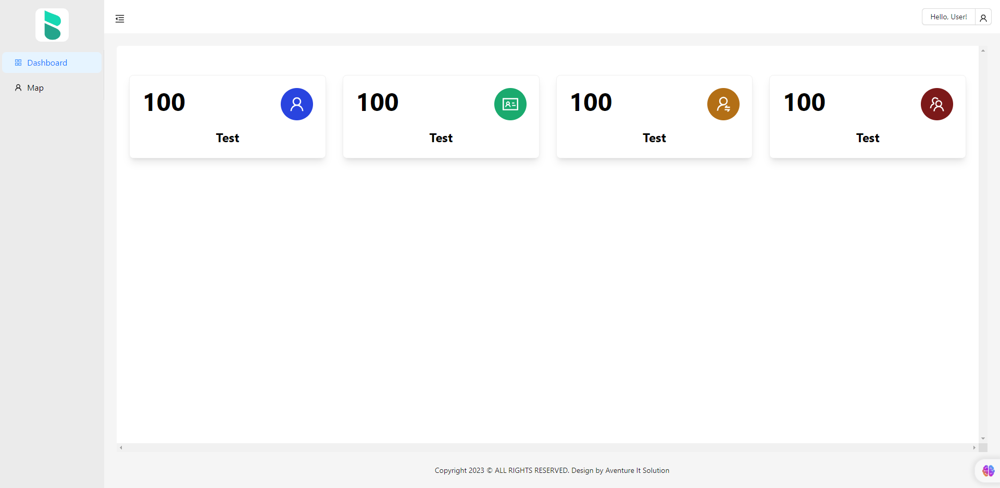

## Ant Design Dashboard

> Free React Admin Dashboard made with Ant Design components and React.



# Starter Admin Dashboard Template

Quick stater Admin Dashboard Template developed using Ant Design components. Also includes google map integration. Fully Responsive Admin Dashboard Template Developed by Mr.Marvo.
[Live Preview](https://antdesign-dashboard-template.netlify.app/)

## Installation

You can clone my repo and play with it as needed. Remember to give a Start and Follow for more...

```bash

  # Clone the repository and change directory into it
  git clone https://github.com/Mr-Marvo/Ant-Design-Dashboard-Template
  cd dashboard-template

  npm install            # Download packages
  npm run start            # Run the dev server
```

## Making Changes

Do what you want, build an amazing Dashboard.

## Learn More

You can learn more about ReactJs, Angular, TailwindCss and more from my github. So please hit [Follow](https://github.com/login?return_to=https%3A%2F%2Fgithub.com%2FMr-Marvo) button.
You can learn more about Blockchain Development and web3 from my github. So please hit [Follow](https://github.com/login?return_to=https%3A%2F%2Fgithub.com%2FMr-Marvo) button.

### Contact Me

If you want any support or If you have any project for me please feel free to contact me.\
View [Github Profile](https://github.com/Mr-Marvo) for contact details.

If you like my project please hit the [star] button
## ☕ [Buy Me a Coffee](https://www.buymeacoffee.com/mr.marvo)
## ⭐ Give a Star
## 💪 [Follow Me](https://github.com/login?return_to=https%3A%2F%2Fgithub.com%2FMr-Marvo) 
## ⚡ [Github](https://github.com/Mr-Marvo)


## Happy Coding ♨
devNishan
